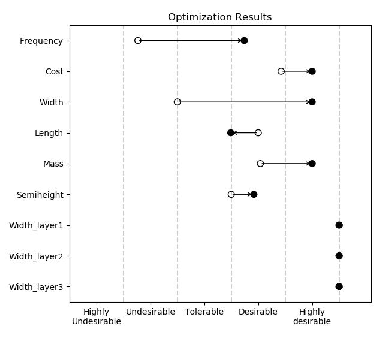

# PhysProg
    
**physprog** ("Physical Programming") is a tool for people who have something 
with multiple metrics they want to optimize simultaneously. You may be an 
engineer wanting to minimize the cost, minimize the weight, and maximize the 
width of a widget. Or you may be a fund manager trying to maximize
your up-market capture ratio while minimizing your down-market capture ratio. 

Regardless of what you want to optimize, it's often a dark-art to weight
multiple performance metrics into one aggregate objective function to pass
off to a general purpose function minimizer. 

**physprog** eliminates the guess-work by taking meaningful preferences for each 
performance metric and building the 
aggregate objective function for you. With this, you can focus your time on 
adjusting the design of your product and less time (no time, really)
adjusting the weights so that they accurately reflect your preferences. 

**physprog** is an implementation of the Messac's Physical Programming algorithm 
[[1](https://messac.expressions.syr.edu/wp-content/uploads/2012/05/Messac_1996_AIAA_PP.pdf)].
For each performance metric, you express your preferences by defining the
boundaries between 6 preference regions: 

* Highly Desirable
* Desirable
* Tolerable
* Undesirable
* Highly Undesirable
* Unacceptable

You can choose between several *class functions* to reflect these
preferences, such as:

* Smaller is better
* Larger is better
* Value is better
* Range is better

Of course, you can also define hard constraints for
performance metrics, as in: "thickness has to be at least 1mm."

**physprog** can just hand you the objective function for you to pass on
to whatever optimization routine you prefer, or it has some basic
code to pass it through [scipy.optimize.minimize](https://docs.scipy.org/doc/scipy/reference/generated/scipy.optimize.minimize.html#scipy.optimize.minimize)
and do the full optimization for you.

The code for this project, as well as the issue tracker, etc. is
[hosted on GitHub](https://github.com/partofthething/physprog)

# Installing it

Directly from source:

    git clone git@github.com:partofthething/physprog.git
    cd physprog
    python setup.py install
    

# Using it

You only need your preferences to get an objective function out of
**physprog**. If you want to do full-on optimization, then you
naturally need a model of your design as well. 

[More coming soon]

# Contributing

You are encouraged to make contributions to make this system more 
useful to everyone. There are automated tests that run with the 
`tox` command so make sure those all pass (including style checks) 
before submitting a PR. If you have a big change in mind you
may want to contact the author 

# License

This package is released under the Apache-2.0 license [reproduced
here](./LICENSE).

# References and See Also

1. [Messac, Achille. "Physical programming-effective optimization for computational design." AIAA journal 34.1 (1996): 149-158.](https://messac.expressions.syr.edu/wp-content/uploads/2012/05/Messac_1996_AIAA_PP.pdf)
2. [Multi-objective optimization (Wikipedia)](https://en.wikipedia.org/wiki/Multiobjective_optimization)